# 📘 Documentação R-training  
## Validação da Plataforma Moodle para Treinamentos de Auditoria

---

### 🏢 Empresa
*RENOVA SOLUÇÕES EM TECNOLOGIA LTDA*  

### 👤 Responsável
**Marcos Vinicius**

### 📅 Período de Execução
*Setembro a Outubro de 2025*

---

## 1. 🎯 Objetivo do Projeto
Validar a plataforma **Moodle** como ferramenta oficial para fornecimento de treinamentos corporativos voltados à preparação dos colaboradores para auditorias **internas e externas**.  
O projeto visa assegurar que o sistema atenda aos requisitos definidos pelo **Setor de Qualidade**, com foco em rastreabilidade, conformidade normativa (ex: **ISO 37301**) e efetividade dos treinamentos.

---

## 2. 🧭 Escopo
O escopo deste trabalho abrange:

- Criação e configuração de um **curso piloto** no Moodle;
- Instalação e testes de **plugins complementares**;
- Validação dos **requisitos funcionais e normativos**;
- Definição de **métodos de armazenamento e exibição de vídeos**;
- Implementação de **avaliação pós-treinamento** e emissão de certificados automáticos.

---

## 3. 📋 Requisitos Avaliados e Soluções Implementadas

| Nº | Requisito | Descrição | Solução Implementada | Status |
|----|------------|------------|----------------------|--------|
| 1 | Controle de Progresso do Treinamento | O vídeo não deve permitir avanço manual; o colaborador precisa assistir por completo. | Utilização do módulo **H5P (Vídeo Interativo)**, configurado para desabilitar avanço por barra de rolagem. | ✅ Atende |
| 2 | Bloqueio de Tela Ativo | O progresso deve ser pausado se o colaborador alternar de janela. | Configuração do **H5P** com pausa automática ao perder o foco da aba. | ✅ Atende |
| 3 | Geração Automática de Certificado | O sistema deve emitir certificado personalizado após conclusão. | Plugin **Custom Certificate**, instalado manualmente. | ✅ Atende |
| 4 | Registro Automatizado de Presença | Gerar lista de presença com data, horário e identificação. | Plugin **Attendance (Presença)**, configurado no curso. | ✅ Atende |
| 5 | Avaliação Pós-Treinamento | Prova com nota mínima 6 e até 3 tentativas. | **Atividade de Questionário (Quiz)** do Moodle, configurada com critérios de aprovação. | ✅ Atende |

---

## 4. ⚙️ Ações Executadas

- Criação de **curso-teste** na plataforma Moodle para validação das funcionalidades.  
- Instalação e configuração dos plugins:
  - **Attendance (Presença)** – para controle automatizado de presença;
  - **Custom Certificate** – para geração de certificados personalizados;
  - **H5P** – para vídeos interativos com controle de progresso.
- Solicitação de **atualização da plataforma Moodle** para compatibilidade de plugins.
- Solicitação de **instalação manual** do plugin de certificado (erro de upload resolvido via suporte técnico).
- Criação de **canal corporativo no YouTube** para hospedagem dos vídeos de treinamento, visando:
  - Reduzir carga no servidor Moodle;
  - Facilitar carregamento e distribuição dos vídeos.
- Upload e integração dos vídeos do canal YouTube nos módulos do curso.
- Configuração de **avaliação final** (Questionário) com nota mínima 6 e limite de 3 tentativas.
- Testes completos de todas as funcionalidades e simulações de uso por diferentes perfis de usuário.

---

## 5. 📈 Resultados Obtidos

- Todos os requisitos técnicos e funcionais foram **atendidos com sucesso**.  
- A plataforma Moodle demonstrou total capacidade de:
  - Rastrear progresso individual;
  - Registrar presença automaticamente;
  - Emitir certificados condicionados à aprovação;
  - Garantir conformidade com normas de rastreabilidade (ISO 37301 e correlatas).  
- Os vídeos integrados via **YouTube + H5P** funcionaram sem sobrecarga do servidor.  
- O ambiente está **pronto para uso nos treinamentos de auditoria** e preparado para expansão futura a outros tipos de capacitação corporativa.

---

## 6. 🧩 Considerações Finais

A validação realizada confirma que o **Moodle** atende plenamente às exigências de rastreabilidade, controle de presença e comprovação de conclusão dos treinamentos corporativos.  

---
## 7. 📎 Anexos e Evidências

Esta seção reúne os **registros visuais e descritivos** de todas as etapas de validação do ambiente Moodle, incluindo a instalação de plugins, configuração de curso, controle de presença, avaliação final e emissão de certificados.

---

### 🧩 **Plugins Instalados**
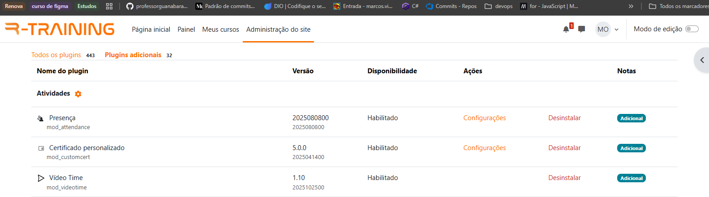

> Os plugins instalados incluem extensões essenciais para o cumprimento dos requisitos definidos pelo setor de Qualidade, tais como o **Attendance (Presença)** e **Custom Certificate** , entre outros módulos de suporte.

---

### 🎓 **Curso de Teste**
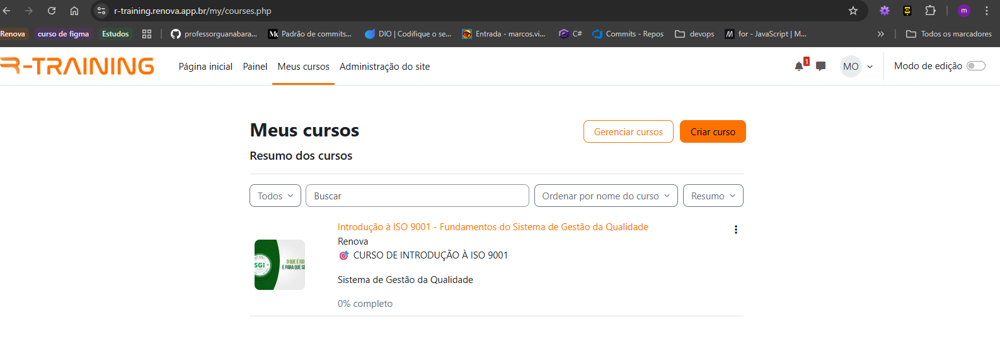

#### 🔍 **Visão Geral do Curso**
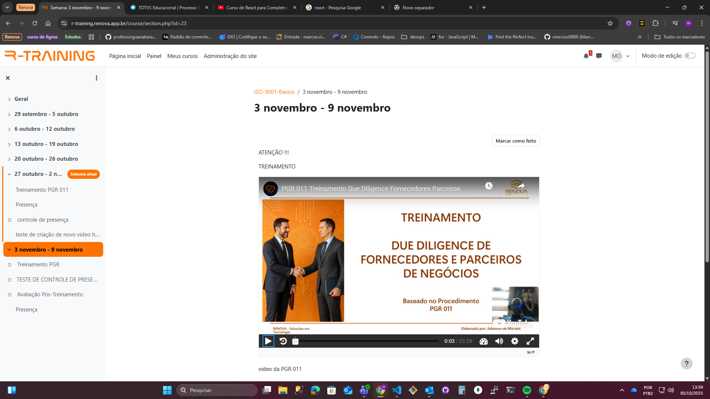  
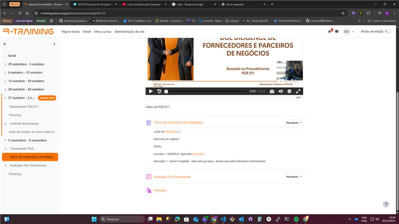

> O curso de teste foi criado especificamente para simular todas as etapas de um treinamento corporativo completo — desde a exibição dos vídeos até a emissão do certificado.  
> A estrutura do curso inclui seções modulares com vídeos interativos, glossário de presença, fórum de registro, questionário de avaliação e certificado final automático.

---

### 🧾 **Lista de Presença Interativa (Assinada pelos Alunos)**

#### 📘 Glossário de Controle de Presença
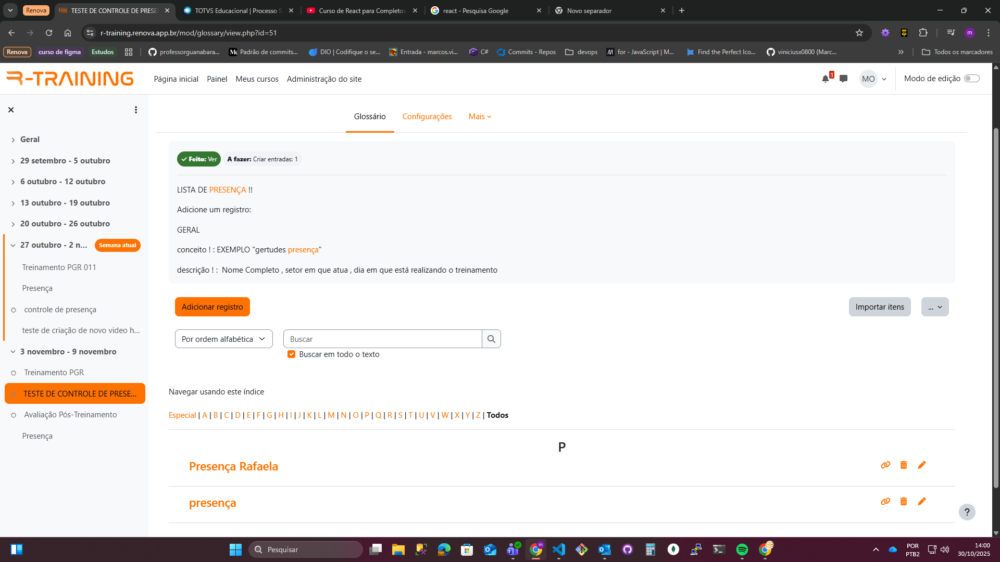

> Utilizou-se a **ferramenta Glossário** do Moodle como meio de registro interativo da presença.  
> Cada colaborador insere sua “assinatura digital” no glossário, o que permite rastrear o nome e o momento do registro.  
> Após a assinatura, o aluno é automaticamente marcado como presente no curso, atendendo aos critérios exigidos para obtenção do certificado.

#### 💬 Fórum de Controle de Presença
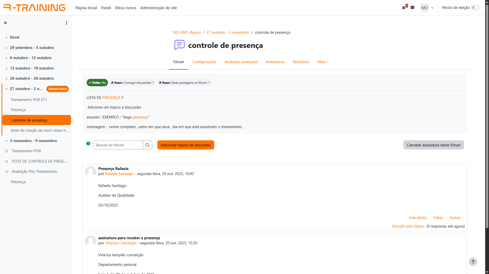

> A opção de **fórum de presença** foi adotada como alternativa principal, pois o sistema já registra automaticamente o nome do participante, a data e a hora da publicação.  
> Essa abordagem facilita a verificação pelos instrutores e mantém evidências claras de participação.

---

### 📆 **Plugin de Presença (Attendance)**
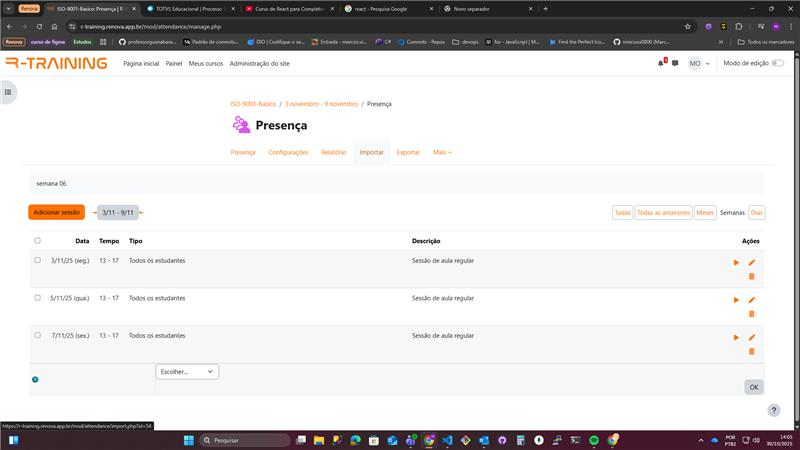  
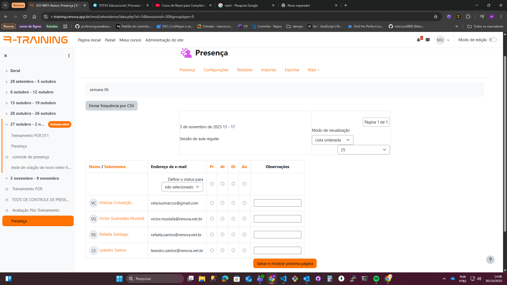  
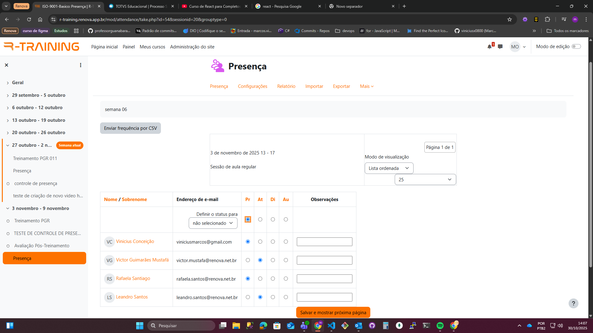  
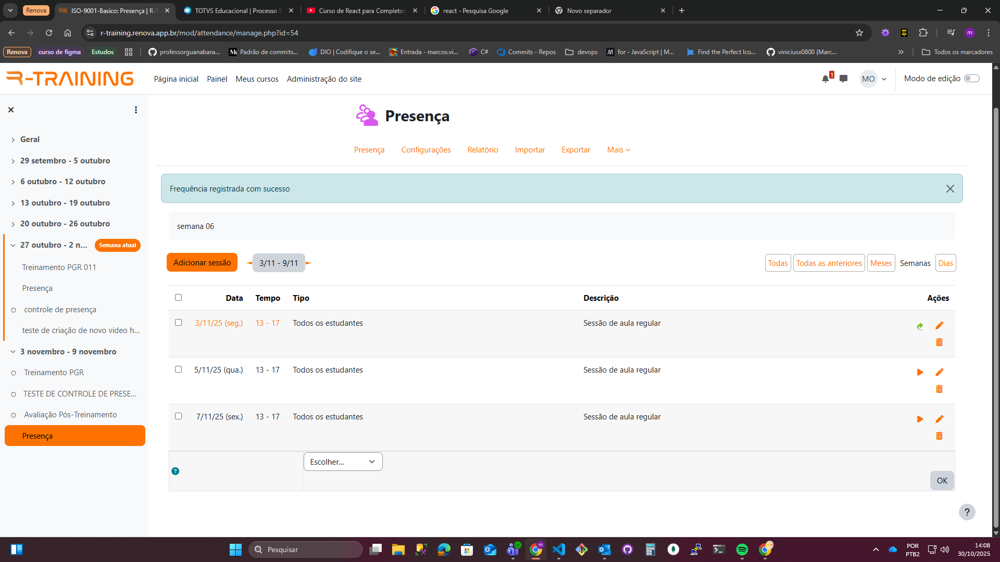

#### 📊 Relatório de Presenças
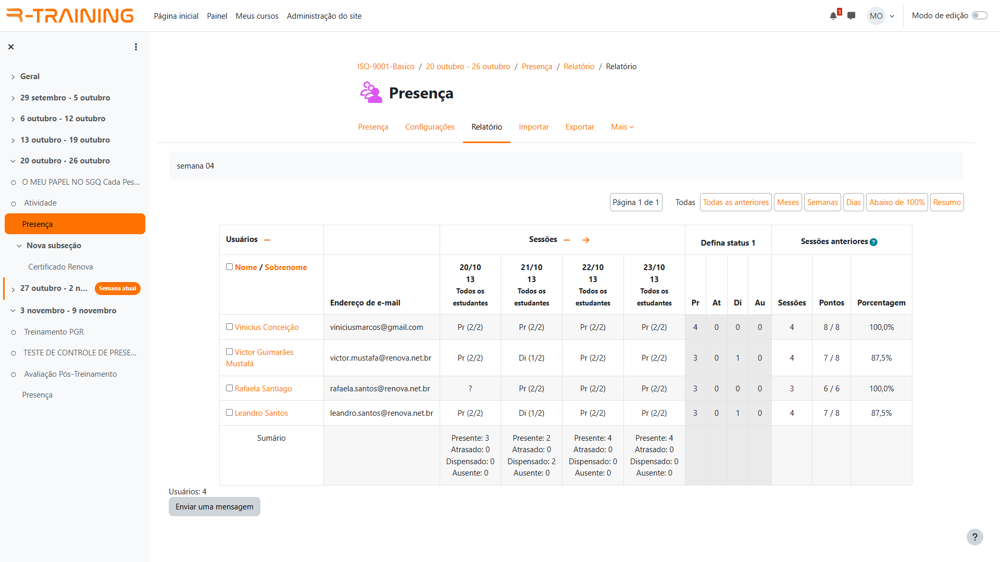

> O **relatório automatizado de presenças** apresenta o registro completo de todos os participantes, datas, horários e status de comparecimento.  
> Esses dados podem ser exportados para planilhas e utilizados como evidência documental em auditorias internas e externas.

---

### 🧠 **Avaliação Final**
  
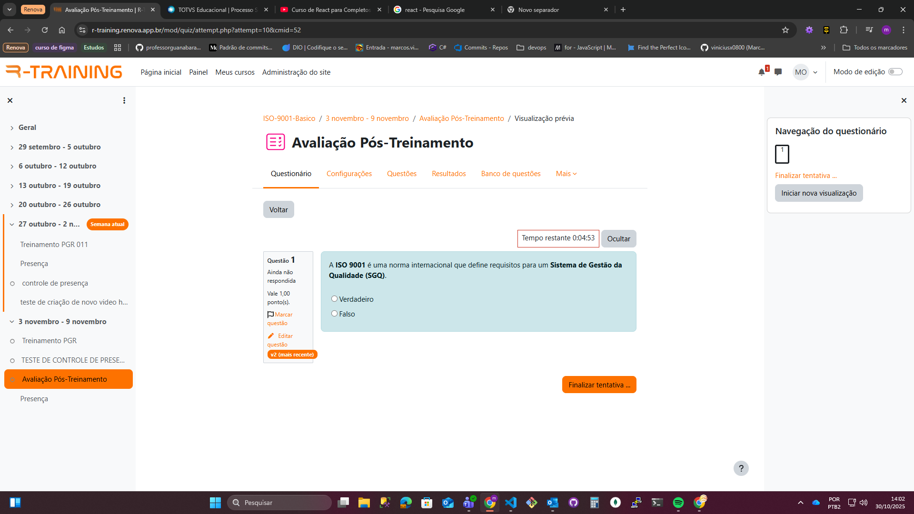  
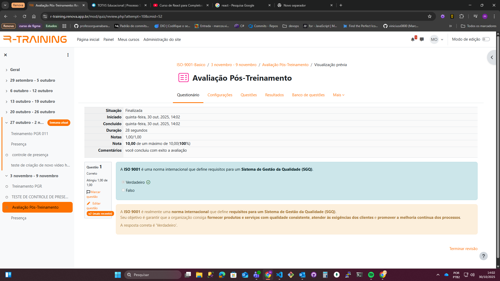

> A avaliação foi configurada utilizando o **módulo de Questionário (Quiz)** do Moodle, com nota mínima de **6,0** e até **3 tentativas permitidas**.  
> O sistema bloqueia a emissão do certificado até que o aluno alcance a nota mínima, garantindo o cumprimento dos critérios de aprovação definidos pelo setor de Qualidade.

---

### 🏆 **Certificados de Conclusão e Participação**

#### 👥 Visão do Aluno
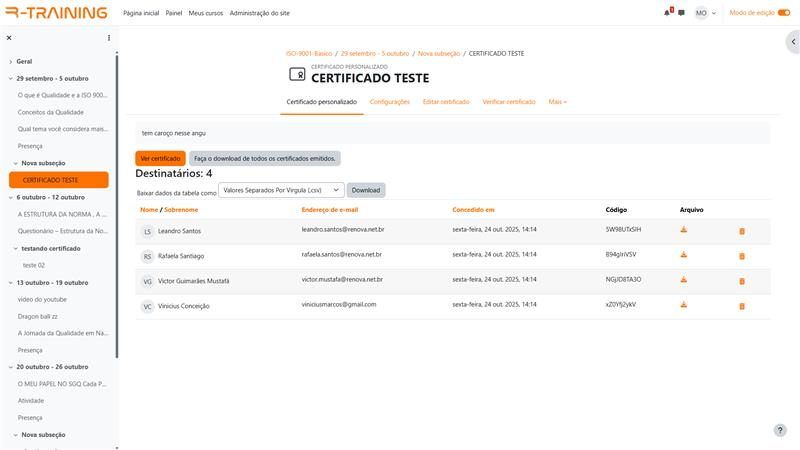

> Nesta tela, os alunos visualizam seus certificados após cumprirem todos os requisitos do curso (presença, visualização dos vídeos e aprovação na avaliação final).

---

#### 📜 **Certificado de Teste 01**
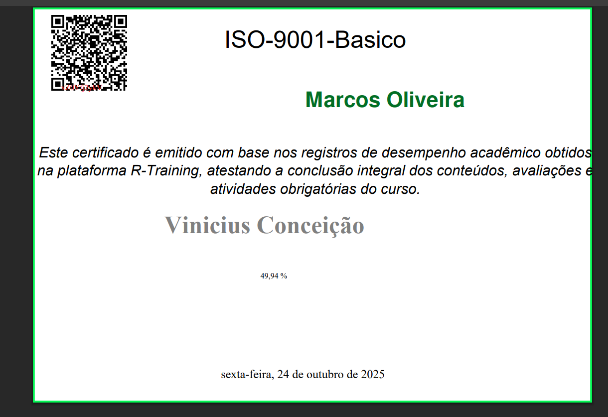

> Este modelo contém as informações principais do treinamento:
> - Nome curto do curso  
> - Nome do professor  
> - Nome do aluno  
> - Data de conclusão  
> - Nota final (em porcentagem)  
> - Código QR para verificação de autenticidade  

---

#### 📜 **Certificado de Teste 02**
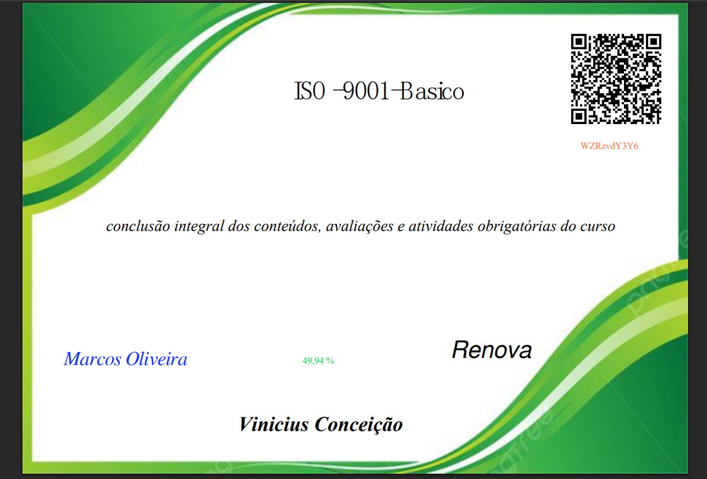

> Modelo aprimorado em relação ao primeiro, com layout mais organizado e adição de uma **imagem de fundo personalizada**, fornecendo **identidade visual institucional** ao certificado.

---

#### 🏅 **Certificado Validado pelo Setor de Qualidade**

> Este foi o modelo oficial aprovado pelo **Setor de Qualidade**, após alinhamento sobre design e informações obrigatórias.  
> O layout final atendeu exatamente à interface desejada e está em conformidade com os padrões de comunicação visual da empresa.

-

> **Resumo:**  
> Todos os recursos apresentados (presença, avaliação, certificados e interação via Moodle) foram testados e validados, comprovando que a plataforma cumpre os requisitos de rastreabilidade, controle e comprovação exigidos para os treinamentos corporativos.

-

> **Documento criado por:** Marcos Vinicius  
> **Data:** 28/10/2025  
> **Versão:** 1.0  
> *(Última atualização manual via Markdown)*
